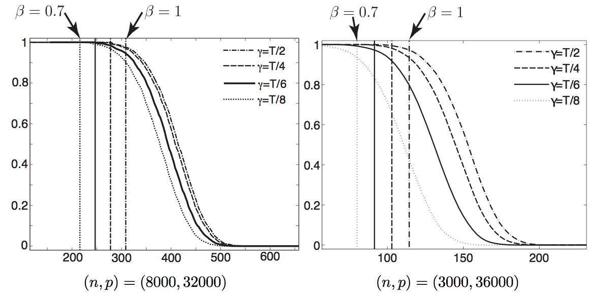

This Matlab package contains the source code to reproduce the figure of the article:

C. Dossal, M.L. Chabanol, G. Peyré, J. Fadili. [Sharp Support Recovery from Noisy Random Measurements by L1 minimization](https://hal.archives-ouvertes.fr/hal-00553670/). Applied and Computational Harmonic Analysis, 33(1), pp. 24–43, 2012.

Each figure is generated by a cript genfigX.m where X=1,2,3.

Beware that the data is collected in an infinite loop ("while true")
so you have to manually stop it when enough samples have been collected
and run the end of the script to plot and save the figure.

Copyright (c) 2009 Gabriel Peyre, Charles Dossal and Jalal Fadili
